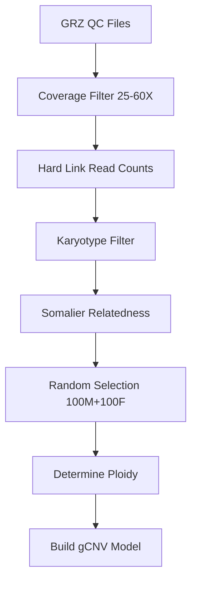

# VarCAD-gCNVModelBuilder

A comprehensive pipeline for building GATK gCNV (germline Copy Number Variant) models with rigorous quality control and sample filtering.

## Overview

This pipeline builds high-quality gCNV models through a multi-step filtering process:

1. **Coverage Filtering**: Select samples with appropriate read depth (25X-60X)
2. **Karyotype Filtering**: Ensure normal diploid autosomes and XX/XY sex chromosomes
3. **Relatedness Filtering**: Remove related samples using Somalier
4. **Sample Selection**: Randomly select balanced cohort (100 males + 100 females)
5. **Model Building**: Generate GATK gCNV model with filtered cohort

## Quick Start

### Requirements

- GATK (>=4.6.0)
- Somalier
- Python 3
- Standard Unix tools (bash, awk, sed, grep)

### Configuration

Update paths in `build_gCNVModel.sh`:

```bash
BASE_PATH="/mnt/storage/genetic_data/WGS"
INTERVALS_FILE="${SCRIPT_DIR}/assets/hg38.preprocessed.interval_list"
REFERENCE_FASTA="/path/to/reference.fasta"
```

### Execution

```bash
./build_gCNVModel.sh
```

The pipeline creates a dated directory (YYYYMMDD) with all outputs and logs.

## Pipeline Structure



## Output Structure

```
YYYYMMDD/
├── filtered_by_coverage.txt
├── filtered_by_karyotype/
├── filtered_unrelated/
├── final_samples/
├── filtered_by_read_depth/gCNV/03_read_counts/
├── model/
│   ├── ploidy/
│   └── cohort-model/
└── build_log_YYYYMMDD.log
```

## Documentation

Detailed documentation for each component:

- **[Main Pipeline](docs/build_gCNVModel.md)** - Complete pipeline orchestration and configuration
- **[Coverage Filtering](docs/filter_GRZ_MeanDepthOfCoverage.md)** - GRZ QC parsing and coverage filtering
- **[Karyotype Filtering](docs/filter_karyotype.md)** - Normal karyotype validation
- **[Relatedness Filtering](docs/filter_related.md)** - Somalier-based relationship removal
- **[Sample Selection](docs/select_samples.md)** - Random balanced cohort selection  
- **[Model Building](docs/build_model.md)** - GATK gCNV model construction

## Key Features

- **Versioned outputs**: Date-stamped directories for reproducibility
- **Comprehensive logging**: Timestamped logs for all operations
- **Hard linking**: Efficient storage for read count files
- **Optimized filtering**: Minimal sample removal for relatedness
- **Sex-balanced**: Equal male/female representation
- **Modular design**: Independent scripts for each step

## Customization

Configure in `build_gCNVModel.sh`:

```bash
MIN_COVERAGE=25          # Minimum read depth
MAX_COVERAGE=60          # Maximum read depth
N_MALES=100             # Males to select
N_FEMALES=100           # Females to select
PROTOCOL="wgs.1k"       # Sequencing protocol
```

## Data Requirements

### Input Data Structure

```
BASE_PATH/
├── YYMMDD_SEQUENCER_RUN_FLOWCELL/
│   ├── quality_control/GRZ/G*.hg38.final.txt
│   ├── gCNV/03_read_counts/wgs.1k/G*.hg38.tsv
│   └── somalier/G*.somalier
```

### Required Files

- **GRZ QC files**: MeanDepthOfCoverage metrics
- **Read count TSV**: GATK read counts per interval
- **Somalier files**: Genetic fingerprints for relatedness
- **Intervals list**: Preprocessed genomic intervals
- **Reference FASTA**: Genome reference with index

## Support

For issues, questions, or contributions:

1. Check the [detailed documentation](docs/) for specific components
2. Review logs at `YYYYMMDD/build_log_YYYYMMDD.log`
3. Validate configuration parameters
4. Ensure all dependencies are installed

## License

[Add your license information]

## Citation

[Add citation information if applicable]
